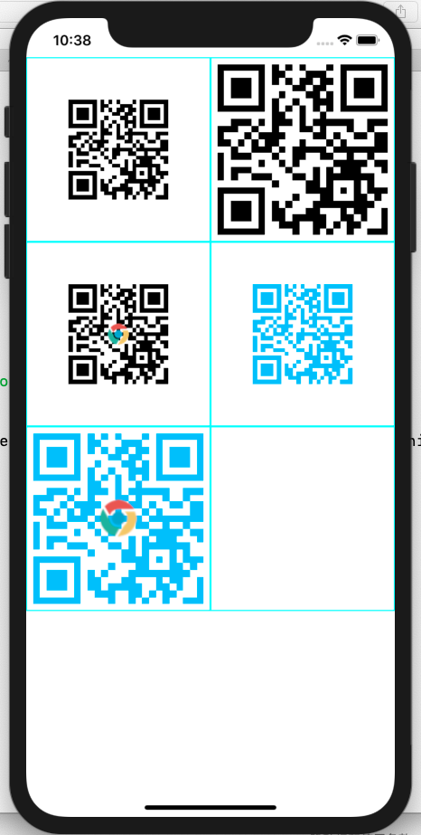

## About SiwftUtils

Extend convenience methods for swift.

## Requirements

* Swift3 or higher

## Supports

* iOS 10 or higher
* macOS 10.10 or higher

## Install

* Carthage  
	make `cartfile` in the root directory of your project.  
	add content `github "yutingLei/SwiftUtils" "master"` to it  
	run command `carthage update`, also add option`--platform iOS` | `--platform MacOS` accroding to your platform


## Usages

- **Color**  

	Typealise `UIColor` and `NSColor` to `SUColor` according to platforms.
	- rgb(red,green,blue)
	- rgb(red,green,blue,alpha)
	- init(hex-string)

  
  ```swift
  // on iOS, use `UIColor`
  // also you can replace `UIColor` with `SUColor`
  let color1 = UIColor.rgb(255, 0, 0) // red
  let color2 = UIColor.rgb(0 0.5, 0) // half green
  let color3 = UIColor.rgb(0, 0, 1) // blue
  // it doesn't matter that has prefix `0x` pr `0x`
  let color4 = UIColor.init(hex: "0xFFF") // white, indicate `r,b,g`
  let color4 = UIColor.init(hex: "0xFFFF") // also is white, but is indicate `r,g,b,a`
  let color5 = UIColor.init(hex: "FFFFFF") // white, rrggbb
  let color6 = UIColor.init(hex: "FFFFFFFF") // white, rrggbbaa
  // on macOS, use `NSColor`
  // also you can replace `NSColor` with `SUColor`
  let color1 = NSColor.rgb(255, 0, 0) // red
  let color2 = NSColor.rgb(0 0.5, 0) // half green
  let color3 = NSColor.rgb(0, 0, 1) // blue
  ```
	
- **String**

	Slice string
	- [..<]
	- [...]
	
	```swift
	let oneString = "hello world"
	let subStr1 = oneString[0..<1] // "h"
	let subStr2 = oneString[0...1] // "he"
	```
	
- **Image**
	
	Process images
	- resizeTo(CGSize)
	- resize(Image, CGSize)

	```swift
	// iOS
	let anImageObj = UIImage(named: "your_image_name")
	// macOS
	let anImageObj = NSImage(named: "your_image_name")
	
	// note: at below, `SUImage` equal `UIImage` on iOS
	//                 `SUImage` equal `NSImage` on macOS
	let newImage1 = anImageObj.resizeTo(CGSize(width: 120, height: 120))
	let newImage2 = SUImage.resize(anImageObj, to: CGSize(width: 120, height: 120))
	```
	
- **QR Code**

	Generate QR Code image
	- generate(content, dstSize?, centeredImage?, graphicColor?)
	
	```swift
	// dstSize: the image's size
	// centeredImage: an image that will be stroked in the center of QR Code
	// graphicColor: which color to stroke
	let qrImage1 = SUtils.generate("hello world") // use options
	let qrImage2 = SUtils.generate("hello world", dstSize: CGSize(width: 200, height: 200)) // custom size
	let qrImage3 = SUtils.generate("hello world", centeredImage: SUImage(named: "your_icon_image")) // with an icon image
	let qrImage4 = SUtils.generate("hello world", graphicColor: SUColor.deepSkyBlue) // custom color
	let qrImage5 = SUtils.generate("hello world",, dstSize: CGSize(width: 200, height: 200), centeredImage: SUImage(named: "your_icon_image"), graphicColor: SUColor.deepSkyBlue) // all vars
	```
	